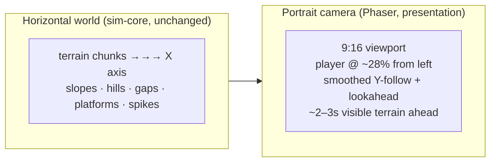
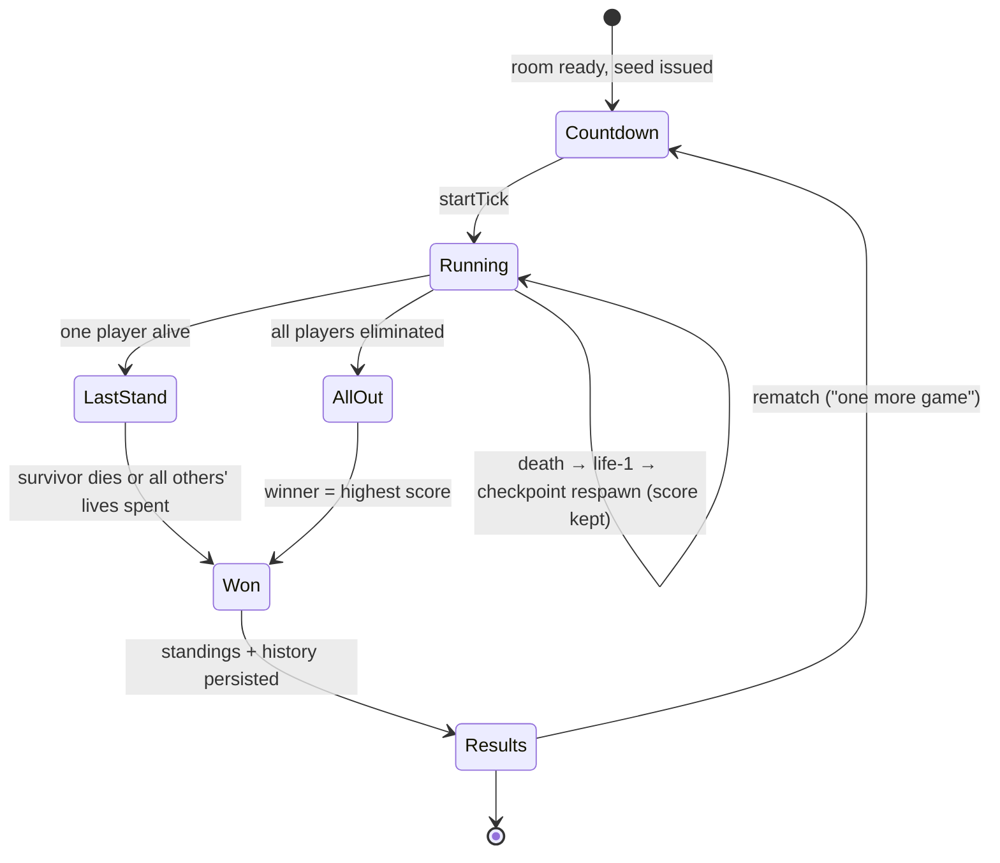
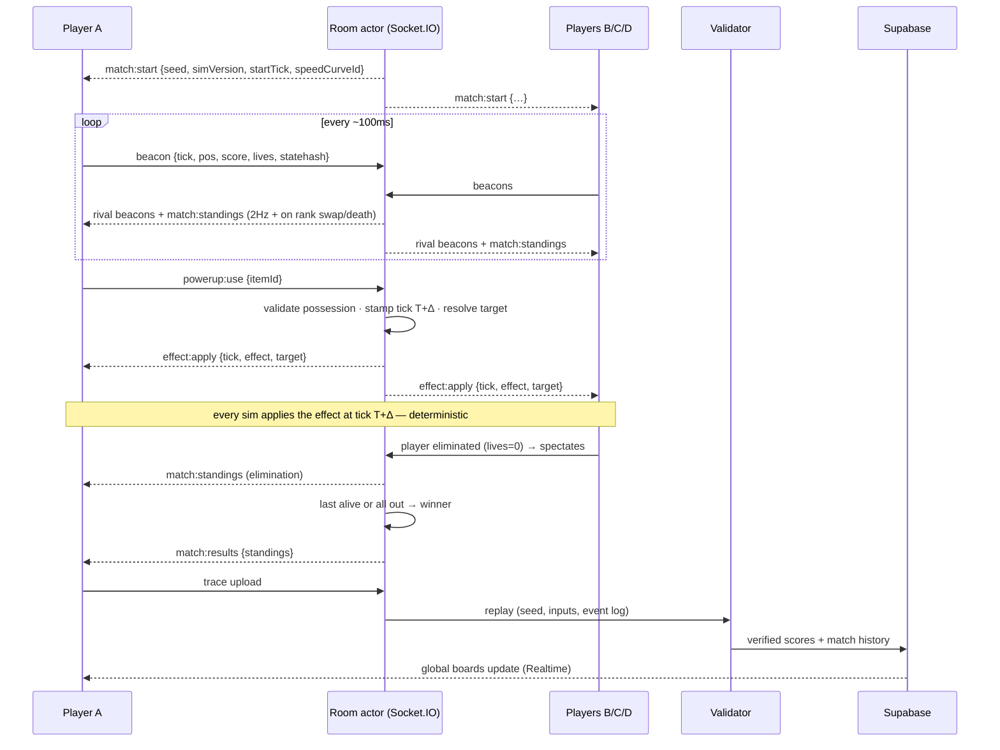
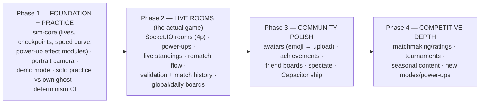

# Architecture Proposal v3 — Vision Alignment Update
### "Project Rebound" — original competitive arcade game (portrait side-scroller, one-thumb, 4-player live rooms)

**Status:** Proposal delta — awaiting approval. No code written.
**Prepared:** July 2026
**Relationship to v2:** This document **only contains sections that changed** after auditing v2 against your Game Vision, plus the reason for each change. Everything not listed in §2 stands exactly as written in v2. **The Game Vision document you provided is now the normative source of truth; where this proposal and the vision ever disagree, the vision wins.**

---

## 1. Vision Alignment Audit

Every vision statement, checked against v2:

| Vision requirement | v2 status | Verdict |
|---|---|---|
| Original game, not a Bounce remake | Aligned (original sim, own feel) | ✅ stands |
| Tap = jump, hold = higher jump; only input is jumping; one thumb | Aligned (press/release input intents) | ✅ stands |
| No joystick / movement buttons; auto-forward | Aligned | ✅ stands |
| **Side-scrolling horizontal world, portrait camera** | **Conflict** — v2 recommended committing to a *vertical/lane-based* run axis for portrait | 🔴 **changed** (§2.1) |
| Slopes, hills, gaps, floating platforms, spikes, hazard zones | Aligned (chunked generator handles all as content) | ✅ stands |
| No finish line; survival + continuous score; 2–5 min matches | **Gap** — v2 modeled races loosely as "first finish/death" | 🔴 **changed** (§2.2) |
| Escalating speed as signature mechanic | Partial — v2 had difficulty-by-distance only | 🟡 **refined** (§2.2) |
| **Multiplayer is the PRIMARY mode**; solo is practice | **Conflict** — v2 phased live rooms to Phase 3, ghosts as the first multiplayer | 🔴 **changed** (§2.4) |
| Max 4 players; players visibly present, not ghosts | Partial — beacon model supports it, but visibility in a narrow camera was unaddressed | 🟡 **refined** (§2.3) |
| No body collision; competition via score + power-ups | Aligned (core netcode assumption) | ✅ stands |
| Bomb / spike trap / shield / boost / slow as real gameplay | **Gap** — v2 treated interaction events as an optional future extra | 🔴 **changed** (§2.3) |
| Skill > power-ups | New constraint — encoded as design rules (§2.3) | 🟡 **added** |
| 3 lives, checkpoint respawn, score kept | **Gap** — v2 had no lives/respawn model | 🔴 **changed** (§2.2) |
| Live in-match leaderboard, updating in real time | **Gap** — v2 only had persistent (Supabase) leaderboards | 🔴 **changed** (§2.3) |
| Emoji avatars default, uploaded pictures later, anonymous always | Mostly aligned (anon-first auth, Storage) | 🟡 **refined** (§2.5) |
| Open source, no ads, no pay-to-win, donations (Ko-fi) | **Conflict** — v2 Phase 4 included a cosmetics *store* and IAP adapters | 🔴 **changed** (§2.6) |
| Don't over-engineer; solo-dev priority | Aligned philosophy — and §2.6/§2.4 *remove* v2 machinery | ✅ strengthened |

Foundational decisions the vision **confirms rather than breaks** — deterministic `sim-core` outside Phaser, fixed 60-tick timestep, seeded chunk generation, input-intent model, beacon-based rivals, replay validation, service interfaces with Local/Remote implementations, React ⟂ Phaser ⟂ sim separation, Node + Socket.IO room actors, Supabase persistence, Netlify + Docker deployment, monorepo layout. None of these change. In fact the vision *depends* on several of them (shared-seed worlds, no-collision netcode, demo mode for solo practice).

---

## 2. Changed Sections

### 2.1 World Presentation & Camera — CHANGED
**(replaces v2 §3.2 "Portrait-first presentation")**

**Why:** v2 recommended committing to a vertical run axis "because portrait favors it." The vision explicitly rejects this: the game is a **horizontal side-scroller viewed through a portrait camera**, and the narrow view is a *feature* — it compresses reaction time and creates the game's tension. The architecture was already axis-agnostic, so this is a presentation-layer change only; sim-core is untouched.

Updated design:

- **World:** standard side-scroller coordinates — X is the run axis, Y is height. The generator produces horizontal terrain (slopes, hills, gaps, floating platforms, hazards) exactly as before.
- **Viewport:** portrait 9:16 logical viewport over that horizontal world. The narrow width means roughly 2–3 seconds of visible terrain ahead at base speed, shrinking as speed ramps — this *is* the difficulty knob the vision describes, and it should be tuned deliberately (visible-lookahead-in-seconds becomes a named design parameter, not an accident of resolution).
- **Camera behavior (Phaser layer, presentation-only):** player anchored in the **left ~28% of screen width** to maximize forward visibility; **smoothed vertical tracking** with lookahead bias in the player's vertical velocity direction (portrait height is an asset here — hills and drops read beautifully in a tall frame); soft vertical dead-zone so small bounces don't shake the camera. All cosmetic, all outside determinism.
- **Fairness rule (new, from the vision's competitive framing):** camera framing must never differ between players in a match — same zoom, same anchor, same lookahead — so no client gains an information advantage. This becomes a stated invariant in the design docs.

### 2.2 Match Systems: Survival, Lives, Checkpoints, Speed — CHANGED
**(extends v2 §4 "Deterministic Simulation"; replaces v2's loose race model)**

**Why:** v2 modeled a match vaguely as "race until first finish/death." The vision defines a precise match grammar — no finish line, 3 lives, checkpoint respawn, score preserved, last-alive-or-highest-score, 2–5 minutes — none of which existed in v2. These are **sim-core rule modules** (they must be deterministic and validation-replayable), not server features.

New sim-core rule modules:

- **Lives & respawn:** each player enters with 3 lives. Death (hazard, fall) consumes one; the player respawns at the **latest checkpoint** after a short invulnerable re-entry window (prevents spawn-kill by terrain or rival power-ups). Score is never reduced. Out of lives ⇒ eliminated, becomes a spectator of the ongoing match (kept in roster, sees live board — feeds "one more game").
- **Checkpoints are generator artifacts:** every chunk deterministically declares its checkpoint anchor(s) as part of `(seed, chunkIdx, simVersion)` generation. Respawn position is therefore identical across all clients and the validator — no server round-trip needed to agree on where someone respawns.
- **Score:** a pure function of survived distance/ticks (plus small deterministic bonuses, e.g. near-miss or pickup bonuses later). Continuous, monotonic, never lost.
- **Speed curve — the signature mechanic:** forward speed is a **named, versioned curve keyed to the shared match clock** (match tick, not per-player distance): Normal → Faster → Very Fast → Extreme Survival. Keying it to the *match clock* rather than per-player distance is a deliberate recommendation: every player in a room experiences the same speed at the same moment (fair, legible, dramatic — "we're all in Extreme now"), respawns don't reset difficulty, and the 2–5 minute match length is enforced *by design*: the curve's tail guarantees no run survives forever. Terrain *content* difficulty stays keyed to distance (chunk index) as in v2; speed pressure is match-time. Solo practice uses the identical curve, so practice trains the real game.
- **Match length is a tuning output, not a timer:** no artificial cutoff — the Extreme tail of the speed curve is calibrated so matches naturally resolve in 2–5 minutes. If playtests run long, the curve steepens; the architecture doesn't change.

Match lifecycle (shared by sim rules + room actor):

### 2.3 Power-Ups & the Live Match Leaderboard: Promoted to Core — CHANGED
**(replaces v2 §5.2's "future light interaction" paragraph and extends the protocol)**

**Why (power-ups):** v2 treated rival-affecting events as an optional Phase-3+ nicety. The vision makes bomb / spike trap / shield / boost / slow the **primary competition mechanic** alongside score. The good news: the mechanism v2 sketched — tick-stamped, server-ordered events applied deterministically by every client's sim — is exactly right; it moves from "future seam" to **core protocol and core sim module**, present from the first multiplayer build.

How power-ups work end-to-end:

- **Spawning is deterministic:** pickups are generator content — `(seed, chunkIdx)` decides where a power-up crate sits. All clients and the validator agree without messages.
- **Activation flows through the room:** a client emits `powerup:use`; the room actor validates possession, stamps it onto a **near-future tick** (~150–250 ms ahead, covering everyone's latency), assigns targets by rule, and broadcasts. Every sim — including each player's own — applies it at that exact tick. Because effects are just another class of tick-stamped input, **replay validation covers them for free**: the validator replays `(seed, own inputs, room event log)`.
- **Effects are self-contained sim modules** with duration, magnitude, and visual descriptor: Bomb (destroys a terrain segment ahead of a rival), Spike Trap (deterministic hazard placed at a target checkpoint zone), Shield (absorbs next negative effect), Speed Boost (self), Slow (rival, brief). Adding a new power-up = one sim module + one render descriptor + a generator table entry, with a `simVersion` bump. No protocol or netcode change.
- **"Skill > power-ups" encoded as testable design rules,** not vibes: no effect may directly kill (only complicate terrain); every offensive effect is telegraphed (visible wind-up on the victim's screen); durations are short (~2–4 s); shields create counterplay; effect frequency is budgeted per match by the generator. These rules live in the design doc as acceptance criteria for every future ability — the vision's "not allowed" list (teleports, flying, body collision) is the permanent negative test.
- **One-thumb constraint — flagged design decision:** the vision says jumping is the *only gameplay input*, but bombs/traps imply an activation moment. Recommendation: **auto-activation** — pickups arm and fire automatically with rule-based targeting (offense targets the nearest rival ahead; defense applies to self). This keeps the input contract pure (tap/hold only), keeps matches readable, and avoids a second button. Alternative (a single "use" tap zone in the lower corner) is still one-thumb-feasible and gives more agency; it costs UI space and splits attention. **Architecture supports both** (activation is just where the `powerup:use` event originates — player tap vs. automatic rule); the choice is a playtest decision, defaulting to auto-activation. This is the only point where the vision is internally ambiguous, so it's flagged rather than silently resolved.

**Why (live leaderboard):** v2's realtime leaderboards were persistent/global (Supabase Realtime). The vision demands an **in-match live ranking** visible at all times — that's a *room-level* concern, latency-sensitive, and belongs on the Socket.IO channel, not the database.

- Beacons already flow to the room at 10 Hz; they now carry `score` and `livesLeft` (a few extra bytes).
- The room actor maintains authoritative-enough live standings and broadcasts a compact `match:standings` diff (rank, score, lives, alive/eliminated per player) at ~2 Hz and instantly on rank swaps, deaths, and eliminations — rank-change moments are the excitement the vision wants, so they're event-driven, not polled.
- The HUD renders a persistent mini-board (4 rows max — the 4-player cap keeps this trivially cheap and readable in portrait). Rank-swap animations, elimination flashes: all presentation-layer.
- Supabase Realtime remains what it was: **persistent** boards (global/daily/season) updated after post-match validation. Two leaderboard systems, two jobs, no overlap.
- **Rival visibility in a narrow camera (refinement):** with a portrait viewport, rivals at different X positions are often off-screen. Rivals render fully when in view; otherwise **edge indicators** (avatar chip + ahead/behind arrow + distance delta) keep all 3 opponents perceptually present at all times — this, plus the live board, is what makes them "real competitors, not invisible ghosts" even when out of frame. Purely presentation-layer.

Updated live match sequence:

### 2.4 Roadmap: Live Rooms Move to the Front — CHANGED
**(replaces v2 §5.1 phase map)**

**Why:** v2 sequenced ghosts (Phase 2) before live rooms (Phase 3) as a cost-reduction strategy. The vision states **multiplayer is the primary mode** — the phased-ghosts-first plan optimized for the wrong product. Live 4-player rooms move directly behind the foundation; ghost racing is demoted from "a phase" to a **solo-practice feature** (race your own best run — it costs almost nothing since traces/replay exist anyway, and it makes practice mode genuinely useful). The validation pipeline that ghosts were meant to harden gets hardened by solo verified daily boards instead.

Two consequences worth naming honestly: **(1)** the first public release now requires the game server (v2's could ship serverless) — mitigated because demo/solo mode still works with zero backend, so the open-source repo and Netlify demo remain infra-free; **(2)** power-up sim modules and the room event log land in Phase 1–2 instead of "later," which is the correct price for making the primary mode primary. Nothing in v2's foundation work is wasted — this is a reordering, not a redesign.

### 2.5 Profiles & Avatars — REFINED
**(extends v2 §6 data model and auth)**

**Why:** the vision specifies emoji-first avatars, optional picture upload later, and permanently frictionless anonymous play. v2's model was compatible but silent on avatars.

- `PROFILE` gains `avatar_kind ('emoji' | 'image')`, `avatar_emoji` (curated set: 🐱 🐶 🤖 👻 🐼 …), `avatar_url` (Supabase Storage, later). Default on first launch: random emoji + generated handle — playing multiplayer requires zero setup, satisfying "no complicated account system."
- Emoji avatars double as the in-match rival markers (edge indicators, mini-board rows) — free, readable at small sizes, and charming; uploaded images (Phase 3) get size/format limits and a **reporting + fallback-to-emoji** moderation path (an open-source multiplayer project will need this; deferring the feature, not the plan).
- Auth remains v2's anonymous-first Supabase flow; optional account linking later preserves the same `player.id`. Unchanged, now vision-confirmed.

### 2.6 Monetization: Store Removed — CHANGED
**(replaces v2 §7 cosmetics economy and parts of the Capacitor adapter table)**

**Why:** v2's Phase 4 included a cosmetics *store* with web payments and Capacitor IAP. The vision rules out all monetization except donations. This is a welcome **simplification** — an entire class of complexity (payments, entitlement purchases, store UI, IAP review compliance) is deleted, which also serves "do NOT over-engineer."

- **Cosmetics stay, commerce goes:** the `renderDescriptor` seam, COSMETIC/ENTITLEMENT tables, and manifest-exchange-at-room-join all remain (they're cheap and the vision still implies visual identity via avatars/future cosmetics) — but entitlements are granted by **achievements, milestones, and seasonal participation**, never purchases. No store service, no store UI, no pay-to-win vector by construction.
- **Donations:** a Ko-fi link in menus/README — a UI element, not a system. No architecture.
- **Capacitor adapter table:** IAP/StoreKit/Play Billing rows deleted. The adapter shrinks (haptics, safe-area, lifecycle, push) — less native surface for a solo dev to maintain.
- Removed from the roadmap entirely: store, payments, purchase entitlements. Removed risk: app-store IAP compliance.

### 2.7 Game Identity Note — ADDED
**(new preamble to the design docs)**

**Why:** the vision opens by declaring this is not a Bounce remake and must immediately feel like its own game. One prototype inheritance in prior documents needs re-framing: v2 spoke of "preserving the prototype's juice/feel." Corrected stance: the prototype's *techniques* (squash-and-stretch, particles, camera shake — generic game-feel craft) may be reused, but the **art direction, character, world identity, tone, and naming start from zero** and belong to a dedicated identity/art-direction effort in Phase 1. "Easy to learn, hard to master, quick matches, one more game" becomes the acceptance test for every design decision — e.g. rematch-in-two-taps from the results screen is a hard requirement, not polish.

---

## 3. Explicitly Unchanged (vision-compatible, do not touch)

Deterministic `sim-core` package outside Phaser (the vision's shared seeded worlds and post-match validation *require* it) · fixed 60-tick loop with render interpolation · seeded chunked procedural generation · input-intent model (maps 1:1 to tap/hold jump) · no-collision beacon netcode (the vision confirms no body collision) · replay-based score validation and anti-cheat layers · service interfaces with Local/Remote implementations and zero-backend demo mode (now hosting "solo practice") · React ⟂ Phaser ⟂ sim-core separation and the GameHost bridge · Zustand, JSON-behind-a-codec protocol, zod boundary validation · single Node process with in-memory room actors and worker-thread validators (a 4-player cap makes one box last even longer than v2 assumed) · Supabase Postgres/Auth/Realtime/Storage roles and RLS split · monorepo layout, determinism CI, ADRs, open-source hygiene · Netlify + Docker/Caddy deployment and the VPS migration path.

---

## 4. Open Design Questions (flagged, with recommendations — not silently resolved)

1. **Power-up activation:** auto-activate on pickup (recommended — preserves "jumping is the only input") vs. a single tap-to-use zone. Playtest decision; architecture supports both identically (§2.3).
2. **Speed curve keying:** shared match clock (recommended — fair, dramatic, enforces 2–5 min) vs. per-player distance. Sim-core takes the curve as a mode parameter either way (§2.2).
3. **Spectator experience after elimination:** minimum (watch leader + live board, recommended for Phase 2) vs. free camera between rivals. Presentation-only; can grow later.

---

*Awaiting approval of v3. On sign-off, the vision document + v2 + this delta together form the source of truth; I'd then fold them into a single consolidated `docs/ARCHITECTURE.md` (plus ADR entries for each §2 change) so the repo starts life with one authoritative document rather than three layered proposals. Still no code until you say so.*
